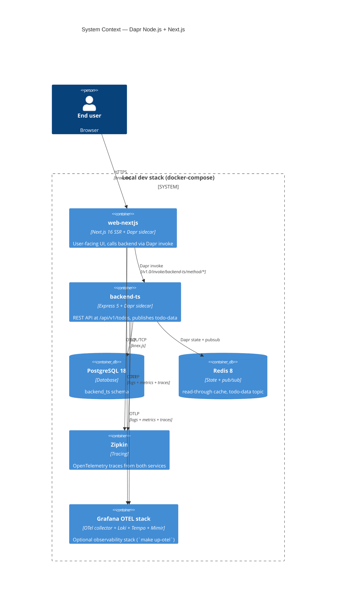
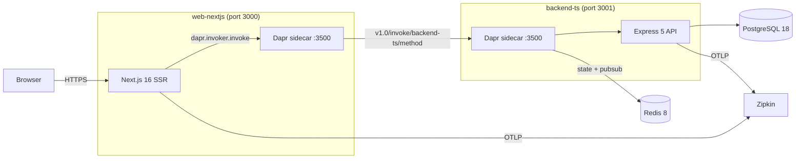
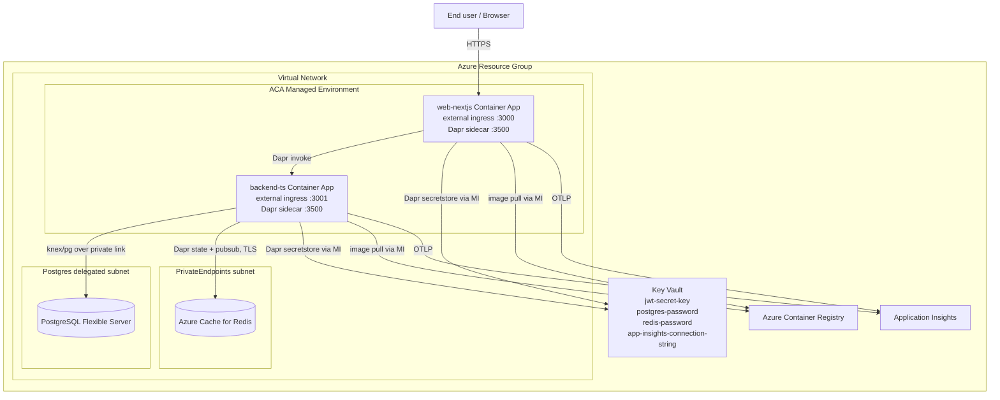

[](https://github.com/AndriyKalashnykov/dapr-nodejs-nextjs/actions/workflows/ci.yml)
[](https://hits.sh/github.com/AndriyKalashnykov/dapr-nodejs-nextjs/)
[](https://opensource.org/licenses/MIT)
[](https://app.renovatebot.com/dashboard#github/AndriyKalashnykov/dapr-nodejs-nextjs)

# Dapr Node.js + Next.js Microservices Platform

Reference implementation of a full-stack Dapr microservices platform on Node.js and TypeScript. A todo-list REST API backend (Express 5 + Postgres) and a Next.js SSR frontend are wired together through Dapr sidecars for state management (Redis), pub/sub messaging, and service-to-service invocation. Azure Container Apps is the production target (see `infra/azure/`); Docker Compose via Podman is the local dev loop.



## Tech Stack

| Component | Technology |
|-----------|-----------|
| Language | TypeScript 6 / Node.js 24 |
| Backend framework | Express 5 + `express-zod-api` |
| Frontend framework | Next.js 16 (App Router, SSR) |
| Database | PostgreSQL 18 + Knex.js migrations |
| Dapr runtime | Dapr 1.17.5 (placement + scheduler + sidecar per service) |
| State / pub/sub | Redis 8 |
| Auth | JWT via `jsonwebtoken` (dev secret in `.env`) |
| Observability | OpenTelemetry SDK → Zipkin + Grafana OTEL stack |
| Tests | Vitest 4 (unit + integration), shell-based compose e2e, Playwright browser e2e |
| Container runtime | Podman 4.9+ (Docker-compatible); `docker compose` in CI |
| Monorepo | pnpm workspaces (`app/*`, `packages/@sos/*`) |
| Production target | Azure Container Apps (`infra/azure/`, Terraform) |

## Quick Start

```bash
make deps && make install && make setup   # install tools, pnpm packages, base images
make build                                # build service containers
make up                                   # start the full stack (Ctrl-C to stop)
```

## Prerequisites

| Tool | Version | Purpose |
|------|---------|---------|
| [GNU Make](https://www.gnu.org/software/make/) | 3.81+ | Build orchestration |
| [Git](https://git-scm.com/) | latest | Version control |
| [mise](https://mise.jdx.dev/) | latest | Manages Node, pnpm, Dapr CLI, act, hadolint, terraform (single source of truth: `.mise.toml`). Install: `curl https://mise.run \| sh` (Linux) or `brew install mise` (macOS) |
| [Podman](https://podman.io/docs/installation) | 4.9+ | Container runtime (Docker-compatible) with Compose |

`make deps` runs `mise install` to fetch all mise-managed tools and installs podman + git via the OS package manager.

Install all required dependencies:

```bash
make deps
```

<details>
<summary>Linux: Podman setup</summary>

```bash
sudo apt-get -y install podman docker-compose-plugin
systemctl --user enable --now podman.socket
export DOCKER_HOST="unix://$XDG_RUNTIME_DIR/podman/podman.sock"
```
</details>

<details>
<summary>macOS: Podman setup</summary>

Podman on macOS runs inside a lightweight VM. Install via Homebrew, initialize and start the VM, then point Docker-compatible tools at the Podman socket:

```bash
brew install podman
podman machine init --cpus 4 --memory 8192 --disk-size 50
podman machine start

# Expose the VM's socket as a Docker-compatible endpoint
export DOCKER_HOST="unix://$(podman machine inspect --format '{{.ConnectionInfo.PodmanSocket.Path}}')"
```

Optional: install Podman Desktop (`brew install --cask podman-desktop`) for a GUI. For `docker compose` parity install the compose plugin: `brew install docker-compose`.

Apple Silicon (M1/M2/M3): the above works natively; the VM defaults to `arm64`. If an image only ships `amd64`, prefix with `podman --arch=amd64` or pull with `--platform linux/amd64`.
</details>

<details>
<summary>Windows: Podman setup</summary>

Install [Podman Desktop](https://podman-desktop.io/) and enable the "Compose" extension.
</details>

## Start, test, stop

```bash
# First time only
make deps           # Check and install required dependencies (node, pnpm, podman, dapr, git)
make install        # Install pnpm dependencies
make setup          # Build base Docker images (run once after clone)

# Start
make build          # Build all service containers in parallel
make up             # Bring up the full stack (Ctrl-C to stop)

# Test — three-layer pyramid
#   unit (seconds, no containers)
make test              # Vitest unit tests — SDK + backend + web-nextjs
make lint              # Lint + typecheck across all workspaces
make static-check      # Composite quality gate (lint + vulncheck + secrets + trivy-fs + mermaid-lint)
make ci                # Full local CI (static-check + test + build)

#   integration (tens of seconds, needs Postgres + Dapr sidecar)
make integration-test  # Backend integration tests (real DB + real sidecar)

#   e2e (minutes, full compose stack)
make e2e               # `make up -d` + e2e/e2e-test.sh + `make down`
make e2e-browser       # Playwright browser tests (stack must already be up)

# Stop
make down           # Tear down the full stack
```

Once running, services are available at:

| Service | URL |
|---|---|
| Next.js SSR frontend | http://localhost:3000 |
| Swagger UI | http://localhost:3001/docs |
| Backend API (direct) | http://localhost:3001/api/v1/todos |
| Backend API (via Dapr) | http://localhost:3500/v1.0/invoke/backend-ts/method/api/v1/todos |
| Dapr Dashboard | http://localhost:8888 |
| Zipkin tracing | http://localhost:9411 |
| PostgreSQL | localhost:5432 (user/pass: `postgres`) |

### Environment configuration

Every port, host, and feature flag the services read comes from env vars. For local dev, copy `.env.example` → `.env` (both at repo root) and edit as needed. The defaults match what `docker-compose.yaml` exposes (3000, 3001, 3500, 5432, 6379, 9411, 8888, 50005, 50006, 3200, 4318). Never hardcode ports in new code — read `process.env.*` with a documented default.

For parallel test runs on the same host, `scripts/pick-port.sh` returns one free port and `scripts/write-env-ports.sh` writes an env file with free ports for every service (safe to append to `$GITHUB_ENV` in CI).

## Architecture

Each service runs as **two containers**: the app + a Dapr sidecar (`daprd`) in a shared network namespace. All cross-service communication goes through the sidecar — never directly app-to-app.



### Key patterns

- **Service invocation**: `web-nextjs` calls `backend-ts` via `context.dapr.invoker.invoke('backend-ts', 'api/v1/todos', ...)`. The sidecar handles discovery, retries, and tracing — no direct HTTP.
- **State + read-through cache**: On `GET /todos/:id`, the backend fetches from Postgres, then writes to Redis via the Dapr state store. On writes, the cache key is invalidated.
- **Pub/sub**: Write operations publish a `todo-data` CloudEvent via Redis. The consumer subscribes via `app/backend-ts/dapr/components/subscriptions.yaml` and receives at `/consumer/todo-data`.
- **Auth**: JWT bearer tokens signed with `JWT_SECRET_KEY`. Backend extracts the user per request via `AuthMiddleware`.
- **Layered backend**: handler (`express-zod-api` route) → service (business logic, state invalidation, pub/sub) → model (Knex query builder).

### Calling the Backend API

The backend requires a JWT token. Generate one and call the API:

```bash
# Generate a dev token (JWT_SECRET_KEY matches docker-compose: "secret")
TOKEN=$(node -e "console.log(require('jsonwebtoken').sign({sub:'dev-user'}, 'secret'))")

# Direct access (port 3001)
curl -H "Authorization: Bearer $TOKEN" http://localhost:3001/api/v1/todos
curl -X POST -H "Authorization: Bearer $TOKEN" -H "Content-Type: application/json" \
  -d '{"title":"My todo"}' http://localhost:3001/api/v1/todos

# Via Dapr service invocation (port 3500)
curl -H "Authorization: Bearer $TOKEN" \
  http://localhost:3500/v1.0/invoke/backend-ts/method/api/v1/todos
```

## Deployment (Azure Container Apps)

Production target is Azure Container Apps, defined in `infra/azure/`. Terraform provisions: ACA environment + two Container Apps (`backend-ts`, `web-nextjs`, both Dapr-enabled, both external ingress), Azure Cache for Redis, PostgreSQL Flexible Server, Key Vault (with Dapr `azure.keyvault` secretstore component), ACR, VNet + private endpoints, and Application Insights.

```bash
# One-time OIDC federation setup — see docs/deploy-aca.md
# Then:
make e2e-aca   # terraform apply → deploy → smoke → terraform destroy
```

The matching workflow (`.github/workflows/e2e-aca.yml`) runs on `workflow_dispatch` only (Actions → "E2E (ACA)" → Run workflow). It is not triggered on push/PR because each run incurs Azure cost (~$0.05–$0.30 per full cycle) and serializes on Terraform state.



- **Ingress**: both container apps have `external_enabled = true` → public HTTPS endpoints auto-issued by ACA
- **Secrets**: each app has a user-assigned managed identity with `Key Vault Secrets User` role on the KV. Dapr's `azure-keyvault-secretstore` component uses that MI at runtime — no client secrets in app config
- **Private network**: Postgres and Redis are private-endpoint-only; only the ACA subnet can reach them
- **Dapr control plane**: ACA provides placement + scheduler built-in; no separate Helm install or self-hosted services needed

See [docs/deploy-aca.md](./docs/deploy-aca.md) for: OIDC setup, GitHub secrets, what the smoke test does / doesn't validate, cost breakdown, troubleshooting.

## Available Make Targets

Run `make help` to see all targets.

### Setup & Build

| Target | Description |
|--------|-------------|
| `make help` | List available tasks |
| `make deps` | Check and install required dependencies (node, pnpm, podman, dapr, git) |
| `make deps-check` | Print installed tool versions |
| `make deps-prune` | Report unused dependencies via `depcheck` (per workspace) |
| `make deps-prune-check` | Fail if any workspace has unused dependencies (CI gate) |
| `make install` | Install pnpm dependencies |
| `make clean` | Remove build artifacts and node_modules |
| `make setup` | Build base Docker images (run once after clone) |
| `make build` | Build all service containers in parallel |
| `make compile` | Compile SDK and backend TypeScript |

### Stack Management

| Target | Description |
|--------|-------------|
| `make up` | Bring up the full stack (Ctrl-C to stop) |
| `make run` | Alias for 'up' – bring up the full stack |
| `make down` | Tear down the full stack |
| `make up-db` | Bring up PostgreSQL only |
| `make up-dapr` | Bring up Dapr infrastructure (Redis, Zipkin, placement, dashboard) |
| `make up-otel` | Bring up Grafana OpenTelemetry stack (detached) |
| `make up-infra` | Bring up OpenTelemetry + database |
| `make down-otel` | Tear down Grafana OpenTelemetry stack |

### Development

| Target | Description |
|--------|-------------|
| `make format` | Auto-format code with Prettier across all workspaces |
| `make lint` | Run lint and typecheck across all workspaces (also: hadolint, scripts +x guard, terraform validate, mermaid) |
| `make lint-scripts-exec` | Fail if any tracked shell script under `scripts/` is missing the executable bit |
| `make vulncheck` | Run pnpm audit for known vulnerabilities (fails on moderate+) |
| `make secrets` | Scan repo for committed secrets via `gitleaks` |
| `make trivy-fs` | Trivy filesystem scan — CVEs + secrets + Dockerfile misconfigs (CRITICAL,HIGH) |
| `make static-check` | Composite quality gate: `lint` + `vulncheck` + `secrets` + `trivy-fs` + `mermaid-lint` |
| `make test` | Run unit tests across SDK and backend |
| `make integration-test` | Run backend integration tests (requires Postgres + Dapr sidecar) |
| `make test-integration` | Deprecated alias for `integration-test` |
| `make migrate` | Run pending database migrations in running backend-ts container |
| `SERVICE=backend-ts make debug` | Start a service in debug mode (Node inspector on :9229) |
| `SERVICE=backend-ts make terminal` | Open a shell in a running service container |
| `SERVICE=backend-ts make logs` | Tail logs for a specific service |

### Per-workspace CI

| Target | Description |
|--------|-------------|
| `make sdk-ci` | SDK: compile, lint, and test |
| `make backend-lint` | Backend: lint and typecheck |
| `make backend-test` | Backend: unit tests with coverage |
| `make backend-test-integration` | Backend: integration tests with coverage (requires Postgres + Dapr) |
| `make web-nextjs-test` | Next.js: unit tests with coverage |
| `make web-nextjs-ci` | Next.js: lint, test, and build |
| `make infra-validate` | Terraform: `fmt -check` + `validate` + tflint (offline, no Azure) |
| `make mermaid-lint` | Validate every `` ```mermaid `` block in markdown via pinned `minlag/mermaid-cli` |

### Diagnostics

| Target | Description |
|--------|-------------|
| `make psql` | Connect to PostgreSQL CLI (default password: postgres) |
| `make redis-cli` | Connect to Redis CLI |
| `make shell` | Open an alpine shell on the dapr-net network (for nc, ping, etc.) |

### Maintenance

| Target | Description |
|--------|-------------|
| `make prune` | Remove unused Podman containers, images, and volumes |
| `make login` | Login to Docker Hub via Podman |
| `make update` | Update pnpm dependencies to latest allowed versions |
| `make upgrade` | Upgrade pnpm dependencies to latest versions (ignoring ranges) |

### CI / Release

| Target | Description |
|--------|-------------|
| `make ci` | Run full CI pipeline locally (`static-check` + `test` + `build`) |
| `make ci-run` | Run GitHub Actions workflow locally using [act](https://github.com/nektos/act) |
| `make check-version` | Ensure VERSION variable is set and follows semver (vX.Y.Z) |
| `make release VERSION=v1.0.0` | Create and push a release tag |
| `make renovate-validate` | Validate Renovate configuration |
| `make e2e` | Compose-based e2e smoke (local) |
| `make e2e-browser` | Playwright browser e2e (local) |
| `make e2e-aca` | Deploy to ACA, smoke, destroy (**incurs Azure cost**) |

## Database migrations

Migrations run inside the backend container (DB credentials come from Dapr secretstore):

```bash
make up                              # Start the stack
make migrate                         # Run pending migrations
SERVICE=backend-ts make terminal     # Or shell in and create new ones:
pnpm run knex -- migrate:make my-migration
```

Migrations also run automatically on backend startup via `pnpm run dev`.

## CI/CD

GitHub Actions runs on every push to `main`, tags `v*`, and pull requests.

| Job | Triggers | Steps |
|-----|----------|-------|
| **changes** | push, PR, tags | Detect code changes (skips heavy jobs on docs-only PRs via [`dorny/paths-filter`](https://github.com/dorny/paths-filter)) |
| **build** | after changes | Compile SDK, lint & test SDK, upload `sdk-build` artifact |
| **static-check** | after build | Composite gate: `make static-check` (lint + vulncheck + gitleaks + Trivy fs scan + mermaid-lint) |
| **test** | after build | Unit tests across SDK + backend (with coverage) |
| **integration-test** | after build | Backend integration tests with Postgres service + Dapr sidecar |
| **web-nextjs** | after changes | Lint, test & build Next.js SSR frontend |
| **e2e** | after integration-test + web-nextjs | Full-stack compose smoke test (`e2e/e2e-test.sh`) |
| **ci-pass** | after all above | Gate job — fails if any required job failed or was cancelled |

The `changes` detector keeps doc-only changes from running heavy jobs while still triggering the workflow (so Repository Rulesets gating on `ci-pass` are satisfied).

[Renovate](https://docs.renovatebot.com/) keeps dependencies up to date with platform automerge enabled.

### Required secrets and variables

The `ci.yml` workflow needs no secrets — all jobs run with the default `GITHUB_TOKEN`. The `e2e-aca.yml` workflow (manual `workflow_dispatch` only) needs:

| Name | Type | Used by | How to obtain |
|------|------|---------|---------------|
| `AZURE_CLIENT_ID` | Secret | `e2e-aca` job (OIDC login) | AAD app registration Client ID — see [docs/deploy-aca.md](./docs/deploy-aca.md) step 1 |
| `AZURE_TENANT_ID` | Secret | `e2e-aca` job (OIDC login) | Azure AD tenant ID (`az account show --query tenantId -o tsv`) |
| `AZURE_SUBSCRIPTION_ID` | Secret | `e2e-aca` job (OIDC login) | Azure subscription ID |
| `JWT_SECRET_KEY` | Secret | `e2e-aca` job (seeded into Key Vault; smoke script signs JWT with same value) | Generate via `openssl rand -hex 32` |

Set secrets via **Settings → Secrets and variables → Actions → New repository secret**. OIDC federation setup (no long-lived SP secret) is documented in [docs/deploy-aca.md](./docs/deploy-aca.md).

### Supply-chain gates

`make static-check` (run by the `static-check` CI job on every push and PR) bundles:

| Gate | Catches | Tool |
|---|---|---|
| `lint` | Code style, type errors, Dockerfile lints, `scripts/*.sh` missing +x bit, broken Mermaid diagrams | ESLint, `tsc --noEmit`, Prettier, hadolint, `mermaid-cli` |
| `vulncheck` | Known npm CVEs (moderate+) | `pnpm audit` |
| `secrets` | Committed credentials | [gitleaks](https://github.com/gitleaks/gitleaks) — config in `.gitleaks.toml` |
| `trivy-fs` | Filesystem CVEs, secrets, Dockerfile misconfigs (CRITICAL,HIGH) | [Trivy](https://github.com/aquasecurity/trivy) — allowlist in `.trivyignore` |

Image scans on top of that are gated on the manual `e2e-aca` workflow:

| Gate | Catches | Tool |
|---|---|---|
| Trivy image scan (CRITICAL/HIGH blocking) | Base-image CVEs, secrets in layers, Dockerfile misconfigs | `aquasecurity/trivy-action` with `image-ref:` between `docker build` and `docker push` |

`ignore-unfixed: true` skips CVEs with no upstream fix available. Cosign signing, multi-arch, and buildkit attestations are deliberately omitted — the images are ephemeral (destroyed by `terraform destroy` at the end of each run), only consumed by the project's own ACA deploy, and only run on `amd64`.

## Contributing

Contributions welcome — open a PR. Before pushing, run `make ci` for the fast local pipeline and `make e2e` for a full-stack smoke test.

## Further reading

- [Architecture Decision Records](./docs/adr/README.md) — Dapr sidecar, ACA target, Redis broker
- [Deploy to Azure Container Apps](./docs/deploy-aca.md)
- [Create a new service](./docs/create-new-service.md)
- [Setup an Azure Sandbox VM (for running local stack in the cloud)](./docs/setup-azure-sandbox.md)
- [Backend service details](./app/backend-ts/README.md)
