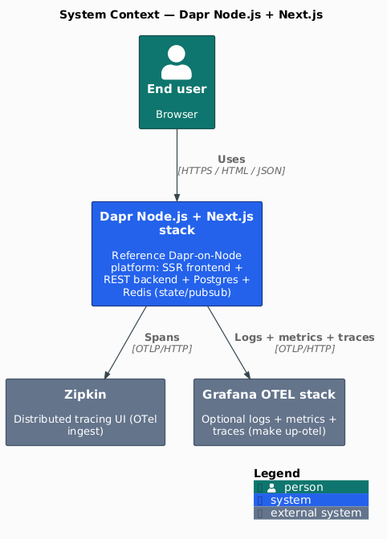
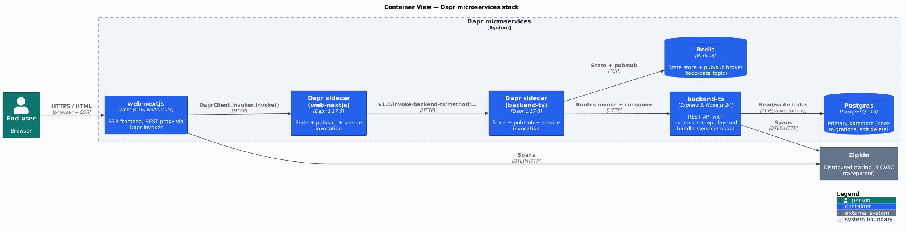
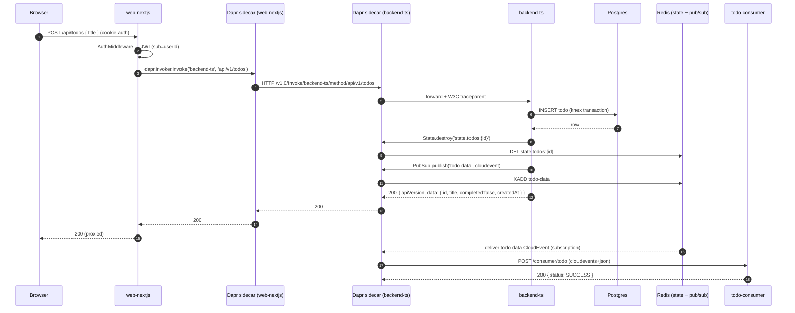
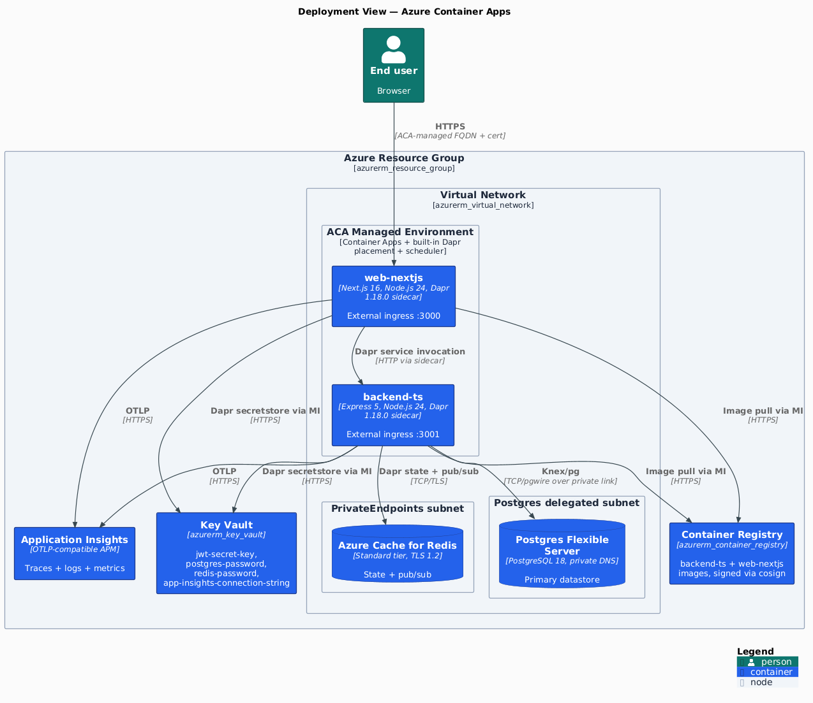

[](https://github.com/AndriyKalashnykov/dapr-nodejs-nextjs/actions/workflows/ci.yml)
[](https://hits.sh/github.com/AndriyKalashnykov/dapr-nodejs-nextjs/)
[](https://opensource.org/licenses/MIT)
[](https://app.renovatebot.com/dashboard#github/AndriyKalashnykov/dapr-nodejs-nextjs)

# Reference Dapr-on-Node Stack — Node.js + Next.js + Azure Container Apps

Reference Dapr-on-Node sample wiring a Next.js 16 SSR frontend (App Router, `@vercel/otel`) and an Express 5 / TypeScript backend through Dapr sidecars for state, pub/sub, and service invocation. The **runtime surface** is a JWT-authed REST API plus SSR pages instrumented via OpenTelemetry SDK to Zipkin + a Grafana OTEL collector, with PostgreSQL 18 as primary datastore (Knex) and Redis 8 as the Dapr-managed state/pubsub backend; the **delivery surface** covers a hardened GitHub Actions pipeline (`pnpm audit`, gitleaks, Trivy fs+image scans, hadolint, mermaid-lint, `lint-docker-no-runtime-pnpm`, OWASP ZAP baseline DAST in the `e2e` job) plus cosign keyless OIDC signing in the manual `e2e-aca.yml` deploy workflow, Renovate-managed deps with Dependabot Alerts fast-track, a nightly `main-rot.yml` workflow, a three-layer test pyramid (Vitest unit + integration, compose-driven shell e2e, optional Playwright browser e2e), an `mise`-pinned toolchain (pnpm v11 workspaces), and an Azure Container Apps Terraform deploy (`infra/azure/`).

<p align="center"></p>

> The C4 **Context**, **Container**, and **Deployment** diagrams are [C4-PlantUML](https://github.com/plantuml-stdlib/C4-PlantUML) sources in [`docs/diagrams/`](docs/diagrams/) (`c4-*.puml`); regenerate the committed PNGs with `make diagrams` (drift-gated by `make diagrams-check`). The sequence diagram below stays inline Mermaid — GitHub renders it directly.

The hero diagram is intentionally Context-level (one box): "what is this and who uses it?". The internal containers (`web-nextjs`, `backend-ts`, Dapr sidecars, Postgres, Redis) are drawn at Container level under [Architecture](#architecture).

## Tech Stack

| Component          | Technology                                                                                                                           |
| ------------------ | ------------------------------------------------------------------------------------------------------------------------------------ |
| Language           | TypeScript 6 / Node.js 24                                                                                                            |
| Backend framework  | Express 5 + `express-zod-api`                                                                                                        |
| Frontend framework | Next.js 16 (App Router, SSR)                                                                                                         |
| Database           | PostgreSQL 18 + Knex.js migrations                                                                                                   |
| Dapr runtime       | Dapr 1.18.0 runtime + CLI (placement + scheduler + sidecar per service)                                                              |
| State / pub/sub    | Redis 8                                                                                                                              |
| Auth               | JWT via `jsonwebtoken` (dev secret in `.env`)                                                                                        |
| Observability      | OpenTelemetry SDK → Zipkin + Grafana OTEL stack                                                                                      |
| Tests              | Vitest 4 (unit + integration), shell-based compose e2e, Playwright browser e2e                                                       |
| Container runtime  | Podman 4.9+ (Docker-compatible); `docker compose` in CI                                                                              |
| Monorepo           | pnpm v11 workspaces (`app/*`, `packages/@sos/*`); config in `pnpm-workspace.yaml` (`allowBuilds`, `overrides`, `publicHoistPattern`) |
| Toolchain pinning  | [mise](https://mise.jdx.dev/) (`.mise.toml`) — Node, pnpm, dapr CLI, act, hadolint, tflint, gitleaks, Trivy, Terraform               |
| Dependency mgmt    | [Renovate](https://docs.renovatebot.com/) (config in `renovate.json`) with `automerge: true` + GitHub Dependabot Alerts fast-track   |
| Production target  | Azure Container Apps (`infra/azure/`, Terraform)                                                                                     |

## Quick Start

```bash
make deps && make install && make setup   # install tools, pnpm packages, base images
make build                                # build service containers
make up                                   # start the full stack (Ctrl-C to stop)
```

## Prerequisites

| Tool                                           | Version | Purpose                                                                                                                       |
| ---------------------------------------------- | ------- | ----------------------------------------------------------------------------------------------------------------------------- |
| [GNU Make](https://www.gnu.org/software/make/) | 3.81+   | Build orchestration                                                                                                           |
| [Git](https://git-scm.com/)                    | 2.30+   | Version control                                                                                                               |
| [mise](https://mise.jdx.dev/)                  | latest  | Cross-language version manager (single source of truth: `.mise.toml`). Manages Node, pnpm, Dapr CLI, act, hadolint, terraform |
| [Podman](https://podman.io/docs/installation)  | 4.9+    | Container runtime (Docker-compatible) with Compose                                                                            |

Install mise once with `curl https://mise.run | sh` (Linux) or `brew install mise` (macOS); then `make deps` runs `mise install` to fetch all mise-managed tools and installs podman + git via the OS package manager.

Install all required dependencies:

```bash
make deps
```

<details>
<summary>Linux: Podman setup</summary>

```bash
sudo apt-get -y install podman docker-compose-plugin
systemctl --user enable --now podman.socket
export DOCKER_HOST="unix://$XDG_RUNTIME_DIR/podman/podman.sock"
```

</details>

<details>
<summary>macOS: Podman setup</summary>

Podman on macOS runs inside a lightweight VM. Install via Homebrew, initialize and start the VM, then point Docker-compatible tools at the Podman socket:

```bash
brew install podman
podman machine init --cpus 4 --memory 8192 --disk-size 50
podman machine start

# Expose the VM's socket as a Docker-compatible endpoint
export DOCKER_HOST="unix://$(podman machine inspect --format '{{.ConnectionInfo.PodmanSocket.Path}}')"
```

Optional: install Podman Desktop (`brew install --cask podman-desktop`) for a GUI. For `docker compose` parity install the compose plugin: `brew install docker-compose`.

Apple Silicon (M1/M2/M3): the above works natively; the VM defaults to `arm64`. If an image only ships `amd64`, prefix with `podman --arch=amd64` or pull with `--platform linux/amd64`.

</details>

<details>
<summary>Windows: Podman setup</summary>

Install [Podman Desktop](https://podman-desktop.io/) and enable the "Compose" extension.

</details>

## Architecture

Each service runs as **two containers**: the app + a Dapr sidecar (`daprd`) in a shared network namespace. All cross-service communication goes through the sidecar — never directly app-to-app.



A few facts not visible on the picture:

- All cross-service traffic flows **app → sidecar → sidecar → app**, never direct app-to-app — the Dapr sidecar handles service discovery, retries, mTLS in cluster modes, and W3C traceparent propagation. See [ADR-0001](./docs/adr/0001-dapr-sidecar.md).
- `backend-ts` is the only writer of Postgres. The sidecar's `redis-statestore` component implements a read-through cache; on writes the cache key is invalidated and a `todo-data` CloudEvent is published. See [ADR-0003](./docs/adr/0003-redis-state-pubsub.md).
- `web-nextjs` does **not** call `backend-ts` HTTP directly. See `app/web-nextjs/src/services/backend-ts.ts` for the Dapr invoker shape.

### Key patterns

- **Service invocation**: `web-nextjs` calls `backend-ts` via `context.dapr.invoker.invoke('backend-ts', 'api/v1/todos', ...)`. The sidecar handles discovery, retries, and tracing — no direct HTTP.
- **State + read-through cache**: On `GET /todos/:id`, the backend fetches from Postgres, then writes to Redis via the Dapr state store. On writes, the cache key is invalidated.
- **Pub/sub**: Write operations publish a `todo-data` CloudEvent via Redis. The consumer subscribes via `app/backend-ts/dapr/components/subscriptions.yaml` and receives at `/consumer/todo-data`.
- **Auth**: JWT bearer tokens signed with `JWT_SECRET_KEY`. Backend extracts the user per request via `AuthMiddleware`.
- **Layered backend**: handler (`express-zod-api` route) → service (business logic, state invalidation, pub/sub) → model (Knex query builder).

### Write path: `POST /todos`

The most non-obvious runtime behaviour — JWT auth, Dapr invocation, state-cache invalidation, and pub/sub fan-out — happens on a single create. The sequence below traces a `POST /todos` from the SSR frontend through to the consumer; ADR notes for the broker choice are in [docs/adr/](./docs/adr/README.md).


```mermaid
sequenceDiagram
    autonumber
    participant U as Browser
    participant N as web-nextjs
    participant Nd as Dapr sidecar (web-nextjs)
    participant Bd as Dapr sidecar (backend-ts)
    participant B as backend-ts
    participant P as Postgres
    participant R as Redis (state + pub/sub)
    participant C as todo-consumer

    U->>N: POST /api/todos { title } (cookie-auth)
    N->>N: AuthMiddleware → JWT(sub=userId)
    N->>Nd: dapr.invoker.invoke('backend-ts', 'api/v1/todos')
    Nd->>Bd: HTTP /v1.0/invoke/backend-ts/method/api/v1/todos
    Bd->>B: forward + W3C traceparent
    B->>P: INSERT todo (knex transaction)
    P-->>B: row
    B->>Bd: State.destroy('state.todos:{id}')
    Bd->>R: DEL state.todos:{id}
    B->>Bd: PubSub.publish('todo-data', cloudevent)
    Bd->>R: XADD todo-data
    B-->>Bd: 200 { apiVersion, data: { id, title, completed:false, createdAt } }
    Bd-->>Nd: 200
    Nd-->>N: 200
    N-->>U: 200 (proxied)

    R-->>Bd: deliver todo-data CloudEvent (subscription)
    Bd->>C: POST /consumer/todo (cloudevents+json)
    C-->>Bd: 200 { status: SUCCESS }
```

### Calling the Backend API

The backend requires a JWT token. Generate one and call the API:

```bash
# Generate a dev token (JWT_SECRET_KEY matches docker-compose: "secret")
TOKEN=$(node -e "console.log(require('jsonwebtoken').sign({sub:'dev-user'}, 'secret'))")

# Direct access (port 3001)
curl -H "Authorization: Bearer $TOKEN" http://localhost:3001/api/v1/todos
curl -X POST -H "Authorization: Bearer $TOKEN" -H "Content-Type: application/json" \
  -d '{"title":"My todo"}' http://localhost:3001/api/v1/todos

# Via Dapr service invocation (port 3500)
curl -H "Authorization: Bearer $TOKEN" \
  http://localhost:3500/v1.0/invoke/backend-ts/method/api/v1/todos
```

## Operations

```bash
# First time only
make deps           # Bootstrap mise + check podman + git
make install        # Install pnpm dependencies
make setup          # Build base Docker images (run once after clone)

# Start
make build          # Build all service containers in parallel
make up             # Bring up the full stack (Ctrl-C to stop)

# Test — three-layer pyramid
#   unit (seconds, no containers)
make test              # Vitest unit tests — SDK + backend + web-nextjs
make lint              # Lint + typecheck across all workspaces
make static-check      # PR-path gate (check-toolchain-alignment + lint + mermaid-lint + diagrams-check + secrets + deps-prune-check)
make cve-check         # CVE scans (pnpm audit + Trivy fs) — tag-gated in CI + daily on main
make ci                # Full local CI (format-check + static-check + test + build)

#   integration (tens of seconds, needs Postgres + Dapr sidecar)
make integration-test  # Backend integration tests (real DB + real sidecar)

#   e2e (minutes, full compose stack)
make e2e               # `make up -d` + e2e/e2e-test.sh + `make down`
make e2e-browser       # Playwright browser tests (stack must already be up)
make dast              # ZAP baseline DAST scan against the running stack

# Stop
make down           # Tear down the full stack
```

Once running, services are available at:

| Service                | URL                                                              |
| ---------------------- | ---------------------------------------------------------------- |
| Next.js SSR frontend   | http://localhost:3000                                            |
| Swagger UI             | http://localhost:3001/docs                                       |
| Backend API (direct)   | http://localhost:3001/api/v1/todos                               |
| Backend API (via Dapr) | http://localhost:3500/v1.0/invoke/backend-ts/method/api/v1/todos |
| Dapr Dashboard         | http://localhost:8888                                            |
| Zipkin tracing         | http://localhost:9411                                            |
| PostgreSQL             | localhost:5432 (user/pass: `postgres`)                           |
| Redis                  | localhost:6379                                                   |
| Grafana OTEL (if enabled) | http://localhost:3200                                         |

### Environment configuration

Every port, host, and feature flag the services read comes from env vars. For local dev, copy `.env.example` → `.env` (both at repo root) and edit as needed. The defaults match what `docker-compose.yaml` exposes (3000, 3001, 3500, 5432, 6379, 9411, 8888, 50005, 50006, 3200, 4318). Never hardcode ports in new code — read `process.env.*` with a documented default.

For parallel test runs on the same host, `scripts/pick-port.sh` returns one free port and `scripts/write-env-ports.sh` writes an env file with free ports for every service (safe to append to `$GITHUB_ENV` in CI).

## Deployment (Azure Container Apps)

Production target is Azure Container Apps, defined in `infra/azure/`. Terraform provisions: ACA environment + two Container Apps (`backend-ts`, `web-nextjs`, both Dapr-enabled, both external ingress), Azure Cache for Redis, PostgreSQL Flexible Server, Key Vault (with Dapr `azure.keyvault` secretstore component), ACR, VNet + private endpoints, and Application Insights.

```bash
# One-time OIDC federation setup — see docs/deploy-aca.md
# Then:
make e2e-aca   # terraform apply → deploy → smoke → terraform destroy
```

The matching workflow (`.github/workflows/e2e-aca.yml`) runs on `workflow_dispatch` only (Actions → "E2E (ACA)" → Run workflow). It is not triggered on push/PR because each run incurs Azure cost (low single-digit USD per cycle — see [docs/deploy-aca.md](./docs/deploy-aca.md) for the breakdown) and serializes on Terraform state.



- **Ingress**: both container apps have `external_enabled = true` → public HTTPS endpoints auto-issued by ACA
- **Secrets**: each app has a user-assigned managed identity with `Key Vault Secrets User` role on the KV. Dapr's `azure-keyvault-secretstore` component uses that MI at runtime — no client secrets in app config
- **Private network**: Postgres and Redis are private-endpoint-only; only the ACA subnet can reach them
- **Dapr control plane**: ACA provides placement + scheduler built-in; no separate Helm install or self-hosted services needed

See [ADR-0002: Choice of ACA as production target](./docs/adr/0002-aca-as-prod-target.md) for the rationale (vs AKS, Container Instances, or App Service).

See [docs/deploy-aca.md](./docs/deploy-aca.md) for: OIDC setup, GitHub secrets, what the smoke test does / doesn't validate, cost breakdown, troubleshooting.

## Available Make Targets

Run `make help` to see all targets.

### Setup & Build

| Target                  | Description                                                             |
| ----------------------- | ----------------------------------------------------------------------- |
| `make help`             | List available tasks                                                    |
| `make deps`             | Check and install required dependencies (node, pnpm, podman, dapr, git) |
| `make deps-check`       | Print installed tool versions                                           |
| `make deps-prune`       | Report unused dependencies via `depcheck` (per workspace)               |
| `make deps-prune-check` | Fail if any workspace has unused dependencies (CI gate)                 |
| `make install`          | Install pnpm dependencies                                               |
| `make clean`            | Remove build artifacts and node_modules                                 |
| `make setup`            | Build base Docker images (run once after clone)                         |
| `make build`            | Build all service containers in parallel                                |
| `make compile`          | Compile SDK and backend TypeScript                                      |
| `make sdk-compile`      | Compile only `@sos/sdk` so backend-ts can resolve its types             |

### Stack Management

| Target           | Description                                                        |
| ---------------- | ------------------------------------------------------------------ |
| `make up`        | Bring up the full stack (Ctrl-C to stop)                           |
| `make run`       | Alias for 'up' – bring up the full stack                           |
| `make down`      | Tear down the full stack                                           |
| `make up-db`     | Bring up PostgreSQL only                                           |
| `make up-dapr`   | Bring up Dapr infrastructure (Redis, Zipkin, placement, dashboard) |
| `make up-otel`   | Bring up Grafana OpenTelemetry stack (detached)                    |
| `make up-infra`  | Bring up OpenTelemetry + database                                  |
| `make down-otel` | Tear down Grafana OpenTelemetry stack                              |

### Code Quality

| Target                             | Description                                                                                                 |
| ---------------------------------- | ----------------------------------------------------------------------------------------------------------- |
| `make format`                      | Auto-format code with Prettier across all workspaces                                                        |
| `make format-check`                | Verify Prettier formatting (CI gate; pairs with `make format`)                                              |
| `make lint`                        | Run lint and typecheck across all workspaces (also: hadolint, scripts +x guard, terraform validate)         |
| `make lint-scripts-exec`           | Fail if any tracked shell script under `scripts/` is missing the executable bit                             |
| `make lint-docker-no-runtime-pnpm` | Fail if a production Dockerfile's runtime CMD invokes pnpm (corepack per-user activation trap)              |
| `make vulncheck`                   | Run pnpm audit for known vulnerabilities (fails on moderate+)                                               |
| `make secrets`                     | Scan repo for committed secrets via `gitleaks`                                                              |
| `make trivy-fs`                    | Trivy filesystem scan — CVEs + secrets + Dockerfile misconfigs (CRITICAL,HIGH)                              |
| `make mermaid-lint`                | Validate every ` ```mermaid ` block in markdown via pinned `minlag/mermaid-cli`                             |
| `make static-check`                | PR-path quality gate: `check-toolchain-alignment` + `lint` + `mermaid-lint` + `diagrams-check` + `secrets` + `deps-prune-check` |
| `make cve-check`                   | CVE scans: `vulncheck` (`pnpm audit`) + `trivy-fs` — tag-gated in CI + daily on `main` |
| `make image-test`                  | container-structure-test: assert a built image's Dockerfile contract (USER, port, entrypoint) |
| `make deps-prune-check`            | Fail if any workspace has unused dependencies (CI gate via `depcheck`)                                      |

### Testing (three-layer pyramid)

| Target                        | Description                                                                     | Runtime         |
| ----------------------------- | ------------------------------------------------------------------------------- | --------------- |
| `make test`                   | Unit tests across SDK and backend (mocked Dapr/SDK context)                     | seconds         |
| `make integration-test`       | Backend integration tests (real Postgres + Dapr sidecar)                        | tens of seconds |
| `make web-nextjs-integration` | Next.js route → real Dapr → real backend (compose-attached; needs `make up -d`) | tens of seconds |
| `make test-integration`       | Deprecated alias for `integration-test`                                         | —               |
| `make e2e`                    | Compose-based e2e smoke (full stack up → curl → down)                           | minutes         |
| `make e2e-browser`            | Playwright browser e2e against running stack                                    | minutes         |
| `make e2e-aca`                | Deploy to Azure Container Apps, smoke, destroy (**incurs Azure cost**)          | ~10–20 min      |

### Service operations

| Target                             | Description                                                     |
| ---------------------------------- | --------------------------------------------------------------- |
| `make migrate`                     | Run pending database migrations in running backend-ts container |
| `SERVICE=backend-ts make debug`    | Start a service in debug mode (Node inspector on :9229)         |
| `SERVICE=backend-ts make terminal` | Open a shell in a running service container                     |
| `SERVICE=backend-ts make logs`     | Tail logs for a specific service                                |

### Per-workspace CI

| Target                          | Description                                                          |
| ------------------------------- | -------------------------------------------------------------------- |
| `make sdk-ci`                   | SDK: compile, lint, and test                                         |
| `make backend-lint`             | Backend: lint and typecheck                                          |
| `make backend-test`             | Backend: unit tests with coverage                                    |
| `make backend-test-integration` | Backend: integration tests with coverage (requires Postgres + Dapr)  |
| `make web-nextjs-test`          | Next.js: unit tests with coverage                                    |
| `make web-nextjs-integration`   | Next.js: compose-attached integration tests (needs `make up -d`)     |
| `make web-nextjs-ci`            | Next.js: lint, test, and build                                       |
| `make infra-validate`           | Terraform: `fmt -check` + `validate` + tflint (offline, no Azure)    |
| `make ci-dapr-up`               | Bring up a Dapr sidecar in slim mode for the integration-test CI job |
| `make ci-db-prepare`            | Prepare the test schema in the CI Postgres service container         |

### Terraform / ACA images

| Target                                                  | Description                                                        |
| ------------------------------------------------------- | ------------------------------------------------------------------ |
| `make tf-init`                                          | `terraform init` in `infra/azure/` (no backend prompt)             |
| `make tf-apply-acr`                                     | Targeted apply: provision only the Azure Container Registry        |
| `make tf-acr-login-server`                              | Print the ACR login server FQDN (requires `make tf-init`)          |
| `make tf-apply`                                         | Full Terraform apply (requires `GIT_SHA` and provisioned ACR)      |
| `make tf-destroy`                                       | Destroy the ACA stack (requires `GIT_SHA` used at apply time)      |
| `SERVICE=… IMAGE_TAG=… make image-build-prod`           | Build a production image (single-arch, `--load` for scan)          |
| `SERVICE=… IMAGE_TAG=… make image-smoke-test`           | Boot a built image and verify it starts cleanly (Pattern A gate 3) |
| `SERVICE=… IMAGE_TAG=… make image-scan-prod`            | Trivy scan a previously built production image                     |
| `SERVICE=… IMAGE_TAG=… REGISTRY=… make image-push-prod` | Build an amd64 image and push to ACR                               |

### Diagnostics

| Target           | Description                                                       |
| ---------------- | ----------------------------------------------------------------- |
| `make psql`      | Connect to PostgreSQL CLI (default password: postgres)            |
| `make redis-cli` | Connect to Redis CLI                                              |
| `make shell`     | Open an alpine shell on the dapr-net network (for nc, ping, etc.) |

### Maintenance

| Target         | Description                                                    |
| -------------- | -------------------------------------------------------------- |
| `make prune`   | Remove unused Podman containers, images, and volumes           |
| `make login`   | Login to Docker Hub via Podman                                 |
| `make update`  | Update pnpm dependencies to latest allowed versions            |
| `make upgrade` | Upgrade pnpm dependencies to latest versions (ignoring ranges) |

### CI / Release

| Target                        | Description                                                                       |
| ----------------------------- | --------------------------------------------------------------------------------- |
| `make ci`                     | Run full CI pipeline locally (`format-check` + `static-check` + `test` + `build`) |
| `make ci-run`                 | Run GitHub Actions workflow locally using [act](https://github.com/nektos/act)    |
| `make check-version`          | Ensure VERSION variable is set and follows semver (vX.Y.Z)                        |
| `make release VERSION=v1.0.0` | Create and push a release tag                                                     |
| `make renovate-validate`      | Validate Renovate configuration                                                   |
| `make dast`                   | ZAP baseline DAST scan against the running stack (requires `make up -d` first)    |

## Database migrations

Migrations run inside the backend container (DB credentials come from Dapr secretstore):

```bash
make up                              # Start the stack
make migrate                         # Run pending migrations
SERVICE=backend-ts make terminal     # Or shell in and create new ones:
pnpm run knex -- migrate:make my-migration
```

Migrations also run automatically on backend startup via `pnpm run dev`.

## CI/CD

GitHub Actions runs on every push to `main`, tags `v*`, and pull requests.

| Job                  | Triggers                            | Steps                                                                                                                     |
| -------------------- | ----------------------------------- | ------------------------------------------------------------------------------------------------------------------------- |
| **changes**          | push, PR, tags                      | Detect code changes (skips heavy jobs on docs-only PRs via [`dorny/paths-filter`](https://github.com/dorny/paths-filter)) |
| **build**            | after changes                       | Compile SDK, lint & test SDK, upload `sdk-build` artifact                                                                 |
| **static-check**     | after changes                       | PR-path gate: `make static-check` (check-toolchain-alignment + lint + mermaid-lint + diagrams-check + gitleaks + deps-prune-check — **no** CVE scan) |
| **test**             | after build                         | Unit tests across SDK + backend (with coverage)                                                                           |
| **integration-test** | after build                         | Backend integration tests with Postgres service + Dapr sidecar                                                            |
| **web-nextjs**       | after changes                       | Lint, test & build Next.js SSR frontend                                                                                   |
| **e2e**              | after integration-test + web-nextjs | Full-stack compose smoke test (`e2e/e2e-test.sh`) + OWASP ZAP baseline DAST                                               |
| **cve-check**        | tag pushes only                     | CVE scans: `make cve-check` (pnpm audit + Trivy filesystem). PRs skip it; `main-rot.yml` runs it daily on `main`         |
| **docker**           | tag pushes only                     | Matrix (backend-ts, web-nextjs): amd64 build → Trivy image scan → container-structure-test → smoke → **push to GHCR** → cosign sign → SBOM + provenance attest |
| **mermaid-lint**     | docs-only changes                   | Runs `make mermaid-lint` when a markdown-only change skips `static-check` (validates README/CLAUDE Mermaid blocks)        |
| **ci-pass**          | after all above                     | Gate job — fails if any required job failed or was cancelled                                                              |

The `changes` detector keeps doc-only changes from running heavy jobs while still triggering the workflow (so Repository Rulesets gating on `ci-pass` are satisfied).

[Renovate](https://docs.renovatebot.com/) keeps dependencies up to date, merging on green CI (Renovate re-confirms the required `ci-pass` check before merging, rather than GitHub-native platform automerge — avoids the check-registration race on the Ruleset-gated `main`).

### Required secrets and variables

The `ci.yml` workflow needs no secrets — all jobs run with the default `GITHUB_TOKEN`. The `e2e-aca.yml` workflow (manual `workflow_dispatch` only) needs:

| Name                    | Type   | Used by                                                                       | How to obtain                                                                          |
| ----------------------- | ------ | ----------------------------------------------------------------------------- | -------------------------------------------------------------------------------------- |
| `AZURE_CLIENT_ID`       | Secret | `e2e-aca` job (OIDC login)                                                    | AAD app registration Client ID — see [docs/deploy-aca.md](./docs/deploy-aca.md) step 1 |
| `AZURE_TENANT_ID`       | Secret | `e2e-aca` job (OIDC login)                                                    | Azure AD tenant ID (`az account show --query tenantId -o tsv`)                         |
| `AZURE_SUBSCRIPTION_ID` | Secret | `e2e-aca` job (OIDC login)                                                    | Azure subscription ID                                                                  |
| `JWT_SECRET_KEY`        | Secret | `e2e-aca` job (seeded into Key Vault; smoke script signs JWT with same value) | Generate via `openssl rand -hex 32`                                                    |

Set secrets via **Settings → Secrets and variables → Actions → New repository secret**. OIDC federation setup (no long-lived SP secret) is documented in [docs/deploy-aca.md](./docs/deploy-aca.md).

### Supply-chain gates

`make static-check` (run by the `static-check` CI job on every push and PR) bundles:

| Gate                        | Catches                                                                           | Tool                                                                          |
| --------------------------- | --------------------------------------------------------------------------------- | ----------------------------------------------------------------------------- |
| `check-toolchain-alignment` | Node major / pnpm version drift across `.mise.toml`, `package.json`, Dockerfiles  | `grep` comparison (fast-fail, runs first)                                     |
| `lint`                      | Code style, type errors, Dockerfile lints, `scripts/*.sh` missing +x bit          | ESLint, `tsc --noEmit`, Prettier, hadolint                                    |
| `mermaid-lint`              | Broken ` ```mermaid ` blocks in markdown                                          | pinned `minlag/mermaid-cli`                                                   |
| `diagrams-check`            | Committed C4 PNGs out of sync with their `docs/diagrams/*.puml` source            | pinned `plantuml/plantuml` + `git diff --exit-code`                           |
| `secrets`                   | Committed credentials                                                             | [gitleaks](https://github.com/gitleaks/gitleaks) — config in `.gitleaks.toml` |
| `deps-prune-check`          | Unused dependencies in any workspace                                             | `depcheck`                                                                    |

**CVE scanning is tag-gated.** `make cve-check` (`pnpm audit` + Trivy filesystem scan) runs **only on tag pushes** (the `cve-check` CI job) and **daily on `main`** via `main-rot.yml` — not on every PR. This keeps PR CI fast while catching vuln-advisory decay within 24h.

| Gate (tag / main-rot only) | Catches                                                        | Tool                                                                          |
| -------------------------- | -------------------------------------------------------------- | ----------------------------------------------------------------------------- |
| `vulncheck`                | Known npm CVEs (moderate+)                                     | `pnpm audit`                                                                  |
| `trivy-fs`                 | Filesystem CVEs, secrets, Dockerfile misconfigs (CRITICAL,HIGH) | [Trivy](https://github.com/aquasecurity/trivy) — allowlist in `.trivyignore`  |

### Image publishing + hardening (tag pushes → GHCR)

On a **tag push** (`vX.Y.Z`), the `docker` job builds each service image (amd64 — ACA, the deploy target, runs amd64), runs the pre-push gates below, then publishes to **`ghcr.io/<owner>/<repo>/<service>`** with a full supply-chain trail. Any gate failure blocks the publish. (PRs run **no** image build — image work is tag-gated.)

| #   | Gate / step                                   | Catches / does                                                                             | Tool                                                       |
| --- | --------------------------------------------- | ----------------------------------------------------------------------------------------- | ---------------------------------------------------------- |
| 1   | Build local amd64 image (`:scan`)             | Build regressions                                                                          | `docker/build-push-action` (`load: true`)                  |
| 2   | **Trivy image scan** (CRITICAL/HIGH blocking) | CVEs in base image, OS packages, build layers; misconfigs; secret leaks                   | `aquasecurity/trivy-action` (`image-ref:`)                 |
| 3   | **container-structure-test**                  | Dockerfile-contract drift (USER reset to root, wrong port/entrypoint, missing files)      | `container-structure-test` (`compose/structure-test/*`)    |
| 4   | **Smoke test**                                | Image boots cleanly (boot-marker within 30s)                                              | `make image-smoke-test`                                    |
| 5   | Build + push to GHCR                           | Publishes `linux/amd64`                                                                    | `docker/build-push-action` (`push: true`)                  |
| 6   | **Cosign keyless OIDC signing**               | Sigstore signature on the manifest digest                                                 | `sigstore/cosign-installer` + `cosign sign --yes`          |
| 7   | **SBOM + SLSA provenance attestations**        | SPDX SBOM + build provenance attached as OCI referrers (index stays clean, GHCR UI renders) | `anchore/sbom-action` + `actions/attest-sbom` / `attest-build-provenance` |

`ignore-unfixed: true` skips CVEs with no upstream fix. The `build-push` step keeps `provenance: false` + `sbom: false` so the OCI image index has no `unknown/unknown` platform entries (GHCR's "OS / Arch" tab renders); SBOM + provenance are attached as separate referrer attestations instead. (The `e2e-aca.yml` deploy workflow independently builds + scans + signs + pushes to **ACR** for the Azure Container Apps deployment.)

The `e2e` CI job additionally runs an **OWASP ZAP baseline scan** against the running compose stack (`http://localhost:3000`):

| Gate                    | Catches                                                 | Tool                                                                                                           |
| ----------------------- | ------------------------------------------------------- | -------------------------------------------------------------------------------------------------------------- |
| **DAST (ZAP baseline)** | Missing security headers, info leaks, common misconfigs | `make dast` (warn-only via `-I`; only FAIL severity blocks; report uploaded as `zap-baseline-report` artifact) |

The DAST scan is **inlined into `e2e`** (rather than a separate `dast` job) because Next.js fronted by web-nextjs:3000 only boots correctly when the full Dapr-enabled compose stack is up — reusing that stack is cheaper than spinning up a duplicate.

Verify a published image's signature (image tag is v-stripped — `v1.2.3` publishes as `:1.2.3`):

```bash
cosign verify ghcr.io/<owner-lowercase>/<repo-lowercase>/backend-ts:<version> \
  --certificate-identity-regexp 'https://github\.com/<owner>/<repo>/\.github/.*' \
  --certificate-oidc-issuer https://token.actions.githubusercontent.com
```

## Contributing

Contributions welcome — open a PR. Before pushing, run `make ci` for the fast local pipeline and `make e2e` for a full-stack smoke test.

## Further reading

- [Architecture Decision Records](./docs/adr/README.md) — Dapr sidecar, ACA target, Redis broker
- [Deploy to Azure Container Apps](./docs/deploy-aca.md)
- [Create a new service](./docs/create-new-service.md)
- [Setup an Azure Sandbox VM (for running local stack in the cloud)](./docs/setup-azure-sandbox.md)
- [Backend service details](./app/backend-ts/README.md)
